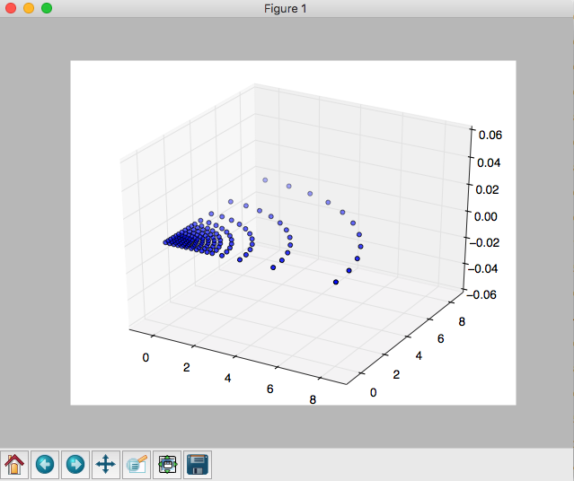

# Prepreprocess4OpenSees

## Usage 

from FEMtools import FEMtools

 #fix the base
FEM_tool.selectAll()
print('kkk',FEM_tool.selectedNodes.shape)
FEM_tool.getNbyLocCyl(x = (r1,r2), y=(angle1,angle2), z = (0,0), tol=0.001) # x is radius, y is angle
 #FEM_tool.getNbyLoc is used for Cartesian  
FEM_tool.setBCFix('baseBCfile',x=1,y=1,z=1,u=0) # fix nodeTage 1 1 1 0, stored in baseBCfile.tcl

 # plot selected nodes
selectedNodes = FEM_tool.selectedNodes
fig = plt.figure()
ax = fig.add_subplot(111, projection='3d')
ax.scatter(selectedNodes[:,1], selectedNodes[:,2], selectedNodes[:,3])
plt.show()

